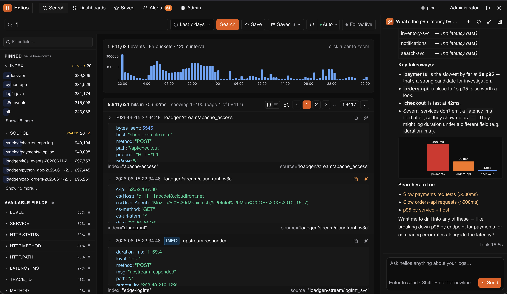

# HeliosLogs README

Welcome to HeliosLogs!

HeliosLogs is a modern log search tool with analytics & AI.



## Components

`src` - helioslogs server

`frontend` - search & admin ui

## Quickstart (Docker)

The fastest way to run HeliosLogs is the published image on Docker Hub:

```bash
docker pull helioslogs/helioslogs:latest

docker run -p 7300:7300 \
  -v helios-data:/app/data \
  -v helios-secret:/app/secret \
  -e HELIOS_ADMIN_EMAIL=you@example.com \
  -e HELIOS_ADMIN_PASSWORD=changeme \
  helioslogs/helioslogs:latest
#  open http://localhost:7300 and log in with the admin email/password above
```

## Build from source

```bash
# rebuild frontend
cd frontend && npm install && npm run build && cd ..

# rebuild backend
cargo build --release

# start backend with frontend
./target/release/helioslogs --data-dir ./data serve --port 7300 --frontend-dir ./frontend/dist
#  listening on http://127.0.0.1:7300
```

## Documentation

Quickstart - https://docs.helioslogs.com/start/quickstart

Data Ingestion - https://docs.helioslogs.com/ingest/overview

Query Language - https://docs.helioslogs.com/search/query-language

AI/LLM Agent - https://docs.helioslogs.com/ai/agent-setup
